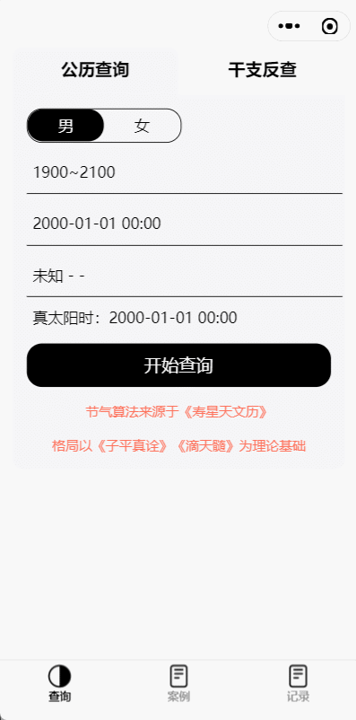
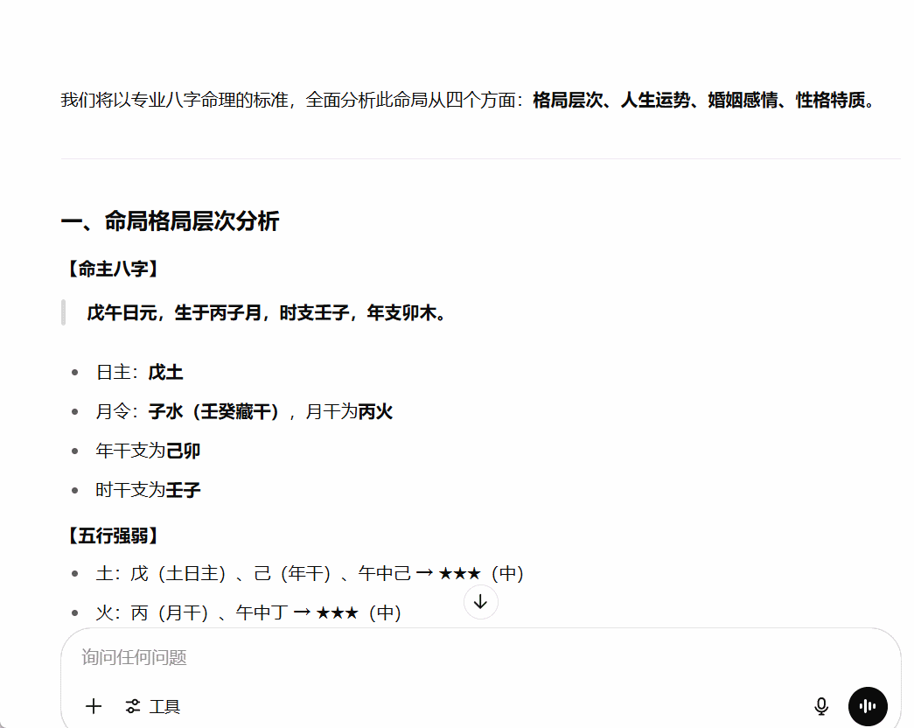

<div align="center">

[简体中文](README.md) | English


<h2 id="title">taro-bazi</h2>
<p>A cross-platform Bazi (Four Pillars) charting tool</p>

</div>

---

## Introduction

**taro-bazi** is a Bazi (Four Pillars of Destiny) charting tool built with **Taro (React)**. It supports **WeChat Mini Programs** and **H5 web** platforms. The project is purely frontend-based and does not require any API calls.

📱 This project is primarily optimized for WeChat Mini Programs. Minor style deviations may occur on the H5 version.

### Key Features

- ✅ **Fully frontend**: No backend or API dependencies, works out of the box  
- 🧮 **Accurate solar term algorithm**: Calculates true solar time using the SXTWL (ShouXing Almanac) algorithm for better accuracy  
- 📅 **Extended time range**: Supports Bazi charting from 100 AD, while most tools only start from 1600 AD  
- ✂️ **One-click AI prompt copy**: Generate prompt templates for AI analysis, including natal chart and luck cycles  
- 🔍 **Heavenly Stems & Earthly Branches reverse lookup**: Check if a certain Bazi chart exists within a specific year range  
- 🎓 **Built-in celebrity cases**: Includes real Bazi data of public figures for learning and reference


## Preview





## Getting Started

### Requirements

- Node.js ≥ 18 (recommended: v18.19.0 or higher)

### Install Dependencies

```bash
yarn install
```

### Run on Web (H5)

```bash
yarn dev:h5
```

### Build for Web (H5)

```bash
yarn build:h5
```

### Run on WeChat Mini Program

```bash
yarn dev:weapp
```

## License

This project is licensed under the [MIT © 2025](./LICENSE).
It is intended for educational use only. For commercial usage, please retain the original author's copyright.